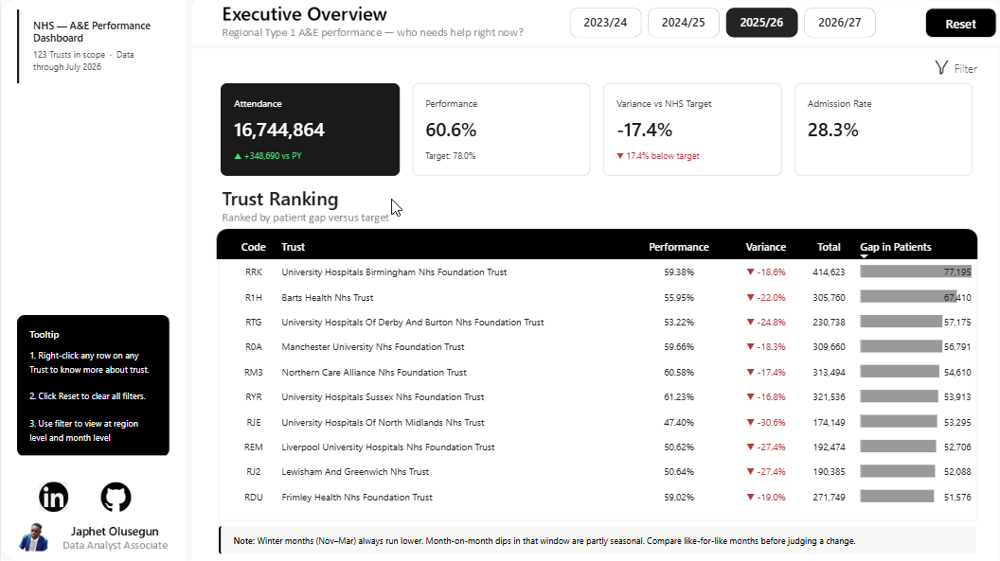

# NHS A&E 4-Hour Performance Dashboard

A Power BI dashboard built on official NHS England A&E attendance data (April 2023 – July 2026) to answer one question a Regional Director of Urgent & Emergency Care actually needs answered: **which hospital trusts need help, and how urgently?**


*(screenshot — Page 1, Executive Overview)*

---

## 90-Second Overview

The NHS has a recovery target for A&E performance: a rising share of patients seen within 4 hours (76% → 78% → 82% across the period covered). The *regional* average usually looks close to target. That's the problem.

A regional average can hide a wide spread — some trusts hitting target comfortably, others badly behind — and if you don't know *which* trusts are dragging the average down, you can't send help to the right place. This dashboard breaks the average apart. It ranks trusts not by how far behind they are in percentage terms, but by how many actual patients would have needed to be seen on time for that trust to hit target — because a 5-point miss at a 30,000-patient trust is a bigger problem than a 10-point miss at a 3,000-patient trust, and a flat percentage ranking gets that backwards.

**Page 1** answers "where do I focus right now." **Page 2** answers "is this trust's problem new, seasonal, or chronic" — because those need different interventions.

---

## The Five Questions

### 1. What problem did i solving?
A Regional Director overseeing multiple NHS trusts needs to decide where to send staff and resources to improve A&E performance against the national 4-hour target. Spreading support evenly — or trusting the regional average — wastes it on trusts that are already fine. This dashboard identifies which trusts are actually behind, ranked by real patient impact rather than raw percentage.

### 2. Where did i data come from?
Official [NHS England A&E Attendances and Waiting Times statistics](https://www.england.nhs.uk/statistics/statistical-work-areas/ae-waiting-times-and-activity/) — 40 separate monthly CSV files (April 2023–July 2026), one file per month, no month column included in the source. Target percentages (76%/78%/82%) were sourced directly from NHS England's own planning guidance documents for each fiscal year, not from secondary reporting.

### 3. What issues did i find in the data?
More than I expected going in. A few highlights (the full list is in the technical documentation):
- A hidden **national-total row** sitting among the per-trust rows, inflating every monthly maximum by roughly 40x until it was isolated and removed.
- Inconsistent **footer "Total" rows** across files — five different casings/spacings of the word "Total," requiring a case-insensitive, whitespace-trimmed filter rather than a simple exact match.
- **34 of 214 organisations** had incomplete month coverage. Three turned out to be genuine, verifiable **NHS trust mergers** (confirmed against primary announcements, not assumed) — the rest were minor-care providers (walk-in centres, urgent treatment centres) outside this dashboard's scope, not data errors.
- A trust with **0 attendances recorded but 1 admission** in the same month — traced to a specific out-of-scope minor injuries unit, documented, and confirmed not to affect any measure.
- A trust showing a **false 100% performance** for two consecutive months — zero breaches recorded against a normal attendance volume, a genuine submission error in the source file, confirmed and excluded from that trust's trend narrative.

### 4. What did my analysis reveal?
- The worst-performing trusts aren't a single story. One trust has been flat and underperforming for the entire 40-month period — its *target* moved, not its performance, which is a very different problem from a trust that was genuinely improving and has recently declined.
- Ranking by raw percentage and ranking by **patient volume** produce materially different "worst 5" lists. The dashboard's primary metric — patients short of target — is the one that actually reflects where the pressure is.
- A's genuine best-practice trust isn't the one with the highest percentage; it's the one hitting target at real scale, handling several times the patient volume of the "top" trust by raw percentage.
- Regional performance has a real, recurring winter dip (roughly November–January), but its depth and shape vary meaningfully year to year — a fact the dashboard flags explicitly so a month-to-month comparison doesn't get misread as a new problem.

### 5. What should the business do next?
Use the Page 1 ranked list — sorted by patients short of target, not percentage — as the starting point for the next quarterly resourcing conversation. Drill into any flagged trust on Page 2 before deciding *what kind* of help to send: a chronically underperforming trust needs a different intervention than one that was improving and has recently slipped.

---

## Show the Mess

The polished dashboard is the end result. The actual work was finding and fixing the problems above — and deciding, with evidence, which anomalies mattered and which didn't. The full process — every data-quality check, every DAX measure's validation against the raw source files, the complete trust-merger investigation, and every design decision along the way — is documented in:

📄 **[Full Technical Documentation](./docs/documentation.md)**
🔗 **[Web View Full Technical Documentation](https://japhetthefirst.github.io/Data-Analysis-Series-From-A-to-Z/)**

That document is intentionally the unpolished one: the dead ends, the things that turned out to be nothing, and the things that turned out to matter.

---

## What's in this repo

```
├── dashboard/
│   └── NHS_AE_Performance.pbix
├── docs/
│   └── documentation.md
└── README.md
```

## Tools

Power BI Desktop · Power Query (M) · DAX · ZoomCharts (Drill Down Combo / TimeSeries PRO)

## Data

[NHS England A&E Attendances and Waiting Times](https://www.england.nhs.uk/statistics/statistical-work-areas/ae-waiting-times-and-activity/) — public, organisation-level data, no patient-level information.

---

*Built by [Japhet Olusegun](https://github.com/Japhetthefirst) as part of a data analyst portfolio.*
